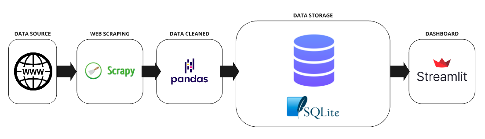

# Projeto de Web Scraping para Inteligencia Competitiva
Este projeto tem como objetivo final coletar dados de um concorrente (neste caso, considera-se que o cliente é uma instituição de ensino que tem como principal serviço cursos de graduação), armazenar os dados de forma estruturada e gerar insights acionáveis sobre os dados coletados. Para este fim, as tecnologias utilizadas foram:

- **Web Scraping**: Scrapy
- **Transform and load**: Pandas
- **Storage**: SQLite3
- **Dashboard**: Streamlit



## Instruções para rodar o projeto
1. Abre o shell do scrapy
```bash
scrapy shell
```

2. Acessa o site para realizar o crawling
```bash
fetch('https://ead.unisinos.br/cursos-graduacao/administracao')
```

3. Pega o response do site (verifica se o site aceita a requisição)
```bash
response
```

4. Retorna todo o texto da página
```bash
response.text
```

5. Para rodar o webscraping no git bash: 
```bash
scrapy crawl unisinos_ead -o ../data/cursos_ead.csv
```

6. Para rodar a ETL
```bash
python src/transformacao/main.py
```

7. Para rodar o streamlit
```bash
streamlit run dashboard/app.py
```

