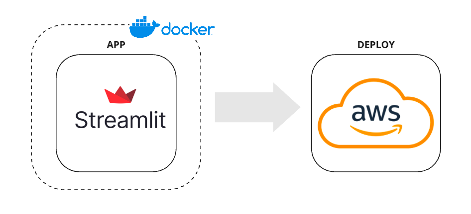

# Deploy de Aplicação de Dados Utilizando Docker



```bash 
git clone https://github.com/jesseabe/PortfolioDE/04-deploy-app-with-docker.git
```

```bash 
docker build -t nome-da-imagem . 
```

```bash 
docker run -d -p 8501:8501 --name deploy-my-app-with-docker-container deploy-my-app-with-docker
```


# Comandos para rodar o projeto na EC2 da AWS

```bash
sudo yum update -y
sudo yum install docker -y
sudo usermod -a -G docker ec2-user
newgrp docker
sudo service docker start
sudo systemctl enable docker
sudo docker run hello-word
sudo yum install git -y
git clone https://github.com/jesseabe/PortfolioDE/04-deploy-app-with-docker.git
cd dashboard
sudo docker build -t deploy-my-app-with-docker-container
sudo docker run -d -p 8501:8501 --name deploy-my-app-with-docker-container deploy-my-app-with-docker
sudo docker ps
```