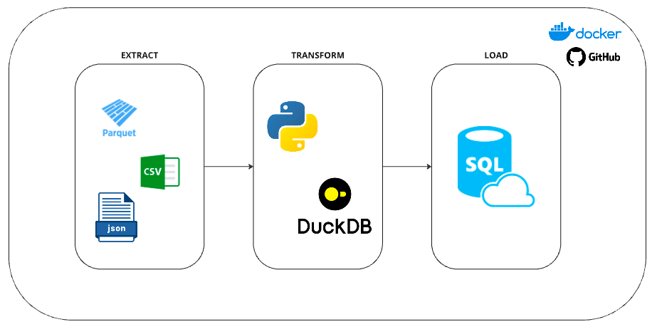

# ELT de Arquivos do Google Drive para o Postgres com Duckdb



```bash 
git clone https://github.com/jesseabe/PortfolioDE/05-etl-with-python-and-duckdb
```
Definir a versão do python
```bash
pyenv local 3.12.1
```

Inicializar o poetry
```bash
poetry init
poetry shell
```


Instalar libs
```bash 
poetry add pandas
poetry add gdown
poetry add duckdb
poetry add sqlalchemy
poetry add python-dotenv
poetry add datime
poetry add streamlit
```
